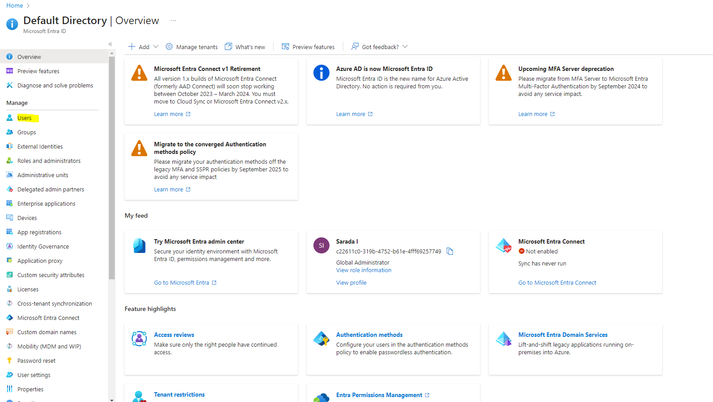

What is Azure Active Directory? Who to Use?
->Azure Active directory is now Microsoft Entra ID
->Enra Id behaves like the safe guard of the organization with a cloud identity and access management soulutions that connects 
    Employess, Customers, Partners to thrie Apps, Devices and Data.
mainly thorugh Azure Active Directpry we're able to do and control 
1. App Integration and Single-sign-on(SSO):
        Connect your workforce to all your apps, from any location, using any device. Simplify app access from anywhere with single sign-on.
2. Password and Multifactor Authentication:
        Help safeguard access to data and apps and keep it simple for users. Provide ease of use without the inherent risk of passwords.
3. Contional Access:
        Apply the right access controls to strengthen your organization’s security.
4. Identity protection
        Automate detection and remediation of identity-based risks.
5. Privileged identity management
        Strengthen the security of your privileged accounts.
6. End-user self-service
        Help your employees securely manage their own identity with self-service portals including My Apps, My Access, My Account, and My Groups.
7. Unified admin center
        Confidently manage all Microsoft Entra multicloud identity and network access solutions in one place.

When comes to active directory we've to mainly concentrate on Authentication & Autherization :
    Authentication :
        It mainly checks is it the right user? (valid credentials are not to login?)
    Autherization :
        Do they have right access ?
Through Azure AD, we can define users,credentials and their access rights.

Azure AD Connect : Synchronize on-prem active directory connection with Azure AD Directory 
    synchronize all user details with passwords
Azure AD MFA : Authenticate users in multiple ways
    something you know, typically a password
    something you have, a device 
    something you are, finger print or face scan
    (when MFA, we can use 2 of 3 above authentication methods)
Azure AD self service password reset : Azure Admins can give access to allow the users to reset the passwords by themselves 

we can create groups, add users and roles.
Subscriptions also connected to active tenants in AD.
Azure AD domain services : azure AD is a toned down version of AD
    Does not provide all the features what AD provide.
    Azure AD is a Flat Structure where as AD is a Heirarchial Org units OU's and Group Policy Objects GPO's
    Azure AD is Web based protocals (Oauth,SAML,open Id) where as AD is Kerbaarose,LDAP,NTML
Role Based Access Control: RBAC
    Congigure Autherization 
    Role Assistance has 3 parts :
        1. Who? (Principal)
        2.What permission?(Role)
        3.What Scope?(Resource/Resource Group/Subscription/Management Group)
    RBAC can provide at any level.

Passwordless Authentication for Azure AD:(Still in progress )
    enable high security and high convenience 
    1. Windows Hello for business
    2. Microsoft Authenticator App
    3. FIDO2 security keys

When Azure Subscription Expires, Azure AD tenant is not deleted ,we can link it with a diff sibscription.

Multiple subscriptions can trust the same Azure AD directory. However, each subscription can only trust only one directory.

